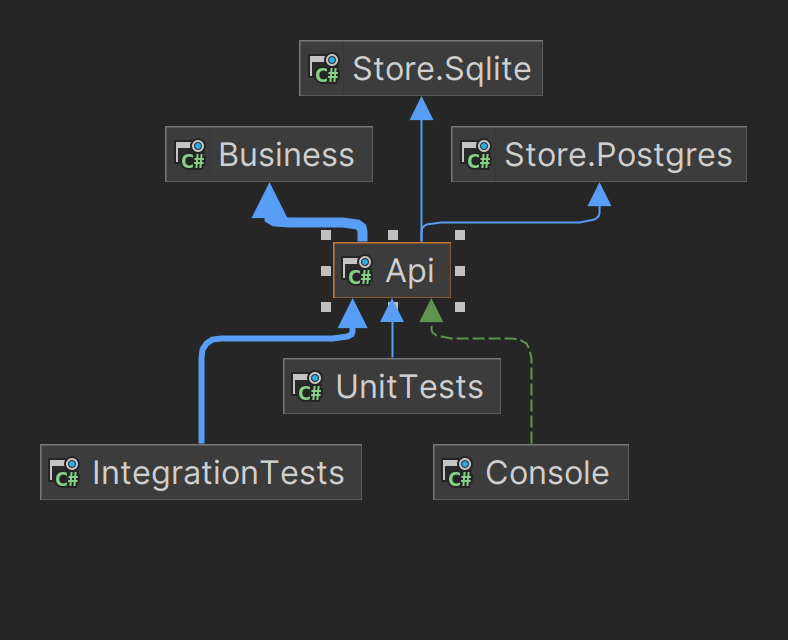
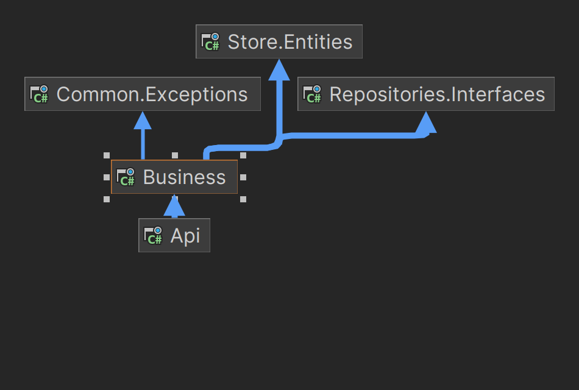

## WMS structure
#### Project coupling diagram

  
Click to expand detailed diagram

  

    <h3>Api</h3>
    
  

  

    <h3>Client</h3>
    
  

  

    <h3>Business</h3>
    
  

  

    <h3>Store.Common</h3>
    
  

  

    <h3>Store.Sqlite</h3>
    
  

  

    <h3>Store.Postgres</h3>
    
  

  

    <h3>Repositories.Interfaces</h3>
    
  

